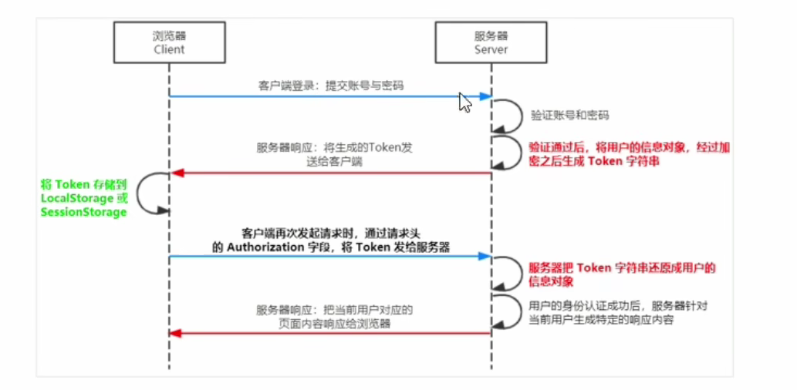

## express 里面前后端身份验证 JWT 认证总结

## session 认证的缺点

> Session 认证机制需要配合 Cookie 才能实现。由于 Cookie 默认不支持跨域访问，所以，当涉及到前端跨域请求后端接口的时候，需要做很多额外的配置，才能实现跨域 Session 认证。
> 注意:
> ● 当前端请求后端接口不存在跨域问题的时候，推荐使用 Session 身份认证机制。
> ● 当前端需要跨域请求后端接口的时候，不推荐使用 Session 身份认证机制，推荐使用 JT 认证机制。

## JWT 是什么

JWT(英文全称:JSON Web Token)是目前最流行的跨域认证解决方案。

## JWT 认证的工作原理



总结：用户信息通过 token 字符串的形式，保存在客户端浏览器中，在需要验证身份的接口中，服务端对请求中的头信息进行分析，还原 token 信息来进行身份认证

## JWT 的组成部分

由三部分组成，分别是 Header(头部)，Payload(有效载荷),Signature(签名)，之间用.分割
其中:

- Payload 部分才是真正的用户信息，"它是用户信息经过加密之后生成的字符串。
- Header 和 Signature 是安全性相关的部分，只是为了保证 Token 的安全性

## JWT 使用方式

客户端收到服务器返回的 JT 之后，通常会将它储存在 localStorage 或 sessionStorage 中。此后，客户端每次与服务器通信，都要带上这个 JWT 的字符串，从而进行身份认证。推荐的做法是把 JWT 放在 HTTP 请求头的 Authorization 字段中，格式如下:

```JS
Authrizatuion:Bearer <token>
```

## 相关依赖

```js
npm i jsonwebtoken express-jwt
```

● `jsonwebtoken 用于生成JWT 字符串`
● `express-jwt 用于将 JWT 字符串解析还原成 JSON 对象`

```bash
"dependencies": {
    "body-parser": "^1.20.2",
    "cors": "^2.8.5",
    "ejs": "^3.1.9",
    "express": "^4.19.2",
    "express-jwt": "^8.4.1",
    "jsonwebtoken": "^9.0.2",
    "mysql": "^2.18.1"
}
```
